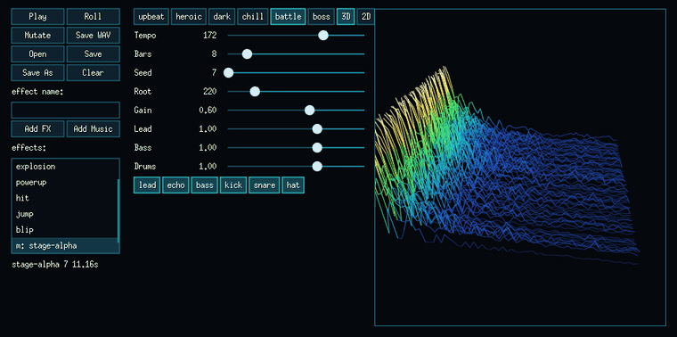

# gion



8-bit sounds and music for games.

gion (擬音) makes retro game audio in two forms. It is a workbench where you sculpt sound effects and chiptune loops by ear, and it is a Go library your game imports to regenerate that exact audio at runtime. Inspired by [sfxr](https://www.drpetter.se/project_sfxr.html) and [bfxr](https://github.com/increpare/bfxr), written from scratch in Go, not a
port.

The premise: a sound is not a file; it is a small deterministic recipe. The
same seed produces the same samples on every platform. Forever. Ship the
recipe and render on the fly, or bake WAVs at build time. Both work; pick per
game.

Written with [Ebitengine](https://ebitengine.org). One executable, nothing to
install alongside it.

**[Try it in the browser](https://crgimenes.github.io/gion/)**: the whole
workbench runs there, and what you make comes home as a file.

## The workbench

Effects start from seven families: pickup, laser, explosion, powerup, hit,
jump, blip. **Roll** re-derives a fresh variation, **Mutate** drifts the
current sound without losing its character, and fifteen sliders expose the
whole synth: waveform, envelope, frequency slide, vibrato, arpeggio,
low-pass, bit crush.

Music comes as perfectly-looping chiptune tracks in six moods: upbeat,
heroic, dark, chill, battle, boss. Each roll picks its own tempo, key,
timbre, chord progression, song form and grooves. All of it derives from
the seed.
A per-instrument mixer and mute switches set the arrangement. A track often
sounds better with a voice removed; gion treats that as an arrangement
decision, saves it in the document, and honors it everywhere the track is
regenerated.

The view is a 3D spectral waterfall (time, frequency, amplitude) that follows
the sliders live while you drag. Spin it with the mouse, or switch to the
plain 2D waveform.

Everything lands in a `.gion` document: a small
[Filo](https://github.com/crgimenes/filo) s-expression file with one named
effect or track per line. It diffs cleanly in git and survives hand edits.

## Download (no Go required)

Grab a prebuilt binary from the
[latest release](https://github.com/crgimenes/gion/releases/latest). You do
**not** need Go or any developer tools.

| System | File to download |
| --- | --- |
| macOS (Intel or Apple Silicon) | `gion-darwin-universal.zip` |
| Windows (64-bit, most common) | `gion-windows-amd64.exe` |
| Windows (older 32-bit) | `gion-windows-386.exe` |
| Windows (ARM) | `gion-windows-arm64.exe` |
| Linux (Intel/AMD 64-bit) | `gion-linux-amd64.gz` |
| Linux (ARM 64-bit) | `gion-linux-arm64.gz` |

### macOS

With [Homebrew](https://brew.sh), one command:

```bash
brew install --cask crgimenes/tap/gion
```

Or by hand: download `gion-darwin-universal.zip`, unzip, move `gion.app` to
**Applications**, double-click. The app is signed and notarized by Apple, so
it opens normally.

If macOS says the app **"is damaged and can't be opened"** or complains about
an unidentified developer:

- Make sure the download finished, and unzip before opening. Re-download if
  in doubt.
- Right-click `gion.app`, choose **Open**, then confirm with **Open**.
- If it still refuses, open **Terminal** and run:

  ```bash
  xattr -dr com.apple.quarantine /Applications/gion.app
  ```

### Windows

Download the `.exe` for your machine and double-click it. Windows SmartScreen
may warn you because the app is not from the Microsoft Store: click
**More info → Run anyway**.

### Linux

Download the matching `.gz`, then decompress and run:

```bash
gunzip gion-linux-amd64.gz
chmod +x gion-linux-amd64
./gion-linux-amd64
```

## Run from source

With Go installed:

```bash
go run github.com/crgimenes/gion/cmd/gion@latest
```

On macOS and Windows there is nothing else to install. On **Linux**,
Ebitengine needs Cgo and the system development libraries, so build with
`CGO_ENABLED=1` after installing the packages from the
[Ebitengine install guide](https://ebitengine.org/en/documents/install.html)
(on Debian/Ubuntu: `libgl1-mesa-dev`, `libasound2-dev`, `libxcursor-dev`,
`libxi-dev`, `libxinerama-dev`, `libxrandr-dev`, `libxxf86vm-dev`,
`pkg-config`).

## Using the sounds in your game

Regenerate at runtime: load the document your team saved in the workbench and
render when you need the samples. An effect renders in under a millisecond; a
full music loop takes a few dozen milliseconds. Same bytes on every platform.

```go
import (
	"github.com/crgimenes/gion"
	"github.com/crgimenes/gion/effects"
)

doc, err := effects.Load("sounds.gion")
// doc.Effects[i].Params and doc.Music[i].Params render on demand:
samples := doc.Effects[0].Params.Render(gion.DefaultRate) // []int16, mono
```

`effects.Parse` does the same over a `//go:embed`-ed document. The
single-executable property survives.

`gion.Mutate` derives a sibling of an effect: same character, slightly
different body. Mutate a base explosion with a varying seed and repeated
explosions stop sounding identical. The asset cost is zero:

```go
boom := doc.Effects[0].Params
samples := gion.Mutate(boom, gameTick).Render(gion.DefaultRate)
```

For engines that just want files, the `gion-render` CLI bakes a document into
one WAV per entry:

```bash
go run github.com/crgimenes/gion/cmd/gion-render@latest -o assets/ sounds.gion
```

It also renders single presets (`gion-render laser`) and standalone music
(`gion-render music battle -seed 7`).

## The `.gion` format

A document is a [Filo](https://github.com/crgimenes/filo) script. Each line declares one named entry, and only
non-default fields are written:

```lisp
(effect "coin"
  (tuple "Freq" 1100)
  (tuple "ArpMult" 1.5)
  (tuple "Decay" 0.25)
  (tuple "Gain" 0.5))
(music "stage 1"
  (tuple "Mood" 4)
  (tuple "Seed" 77)
  (tuple "Mute" 3)
  (tuple "Gain" 0.6))
```

Unknown fields are ignored on load, so an older binary reads documents
written by a newer one. That `Mute 3` is an arrangement decision: this track
plays without its lead anywhere it is rendered.

## License

[MIT](LICENSE)
